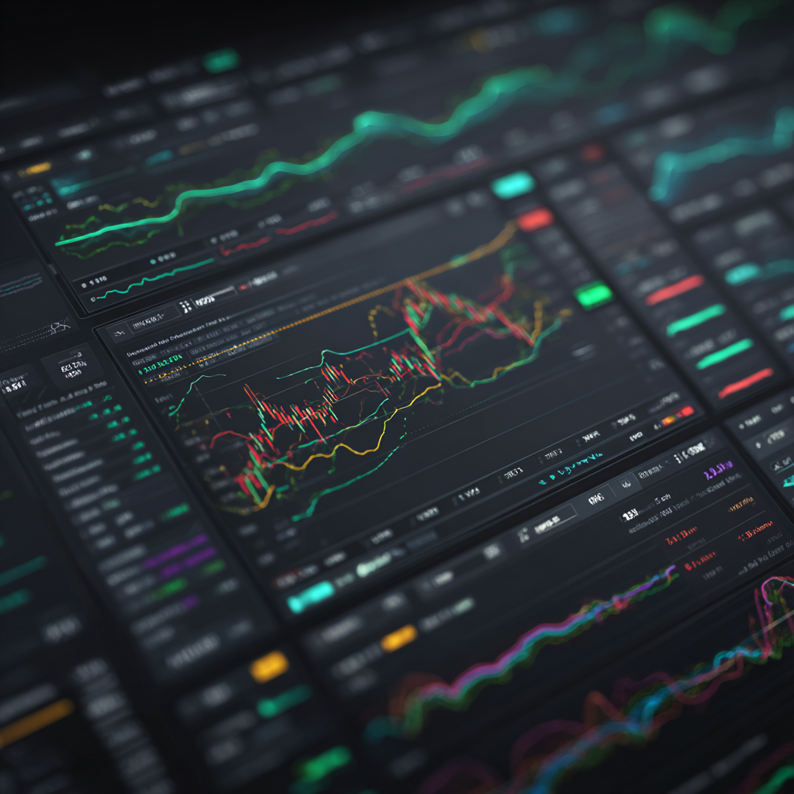
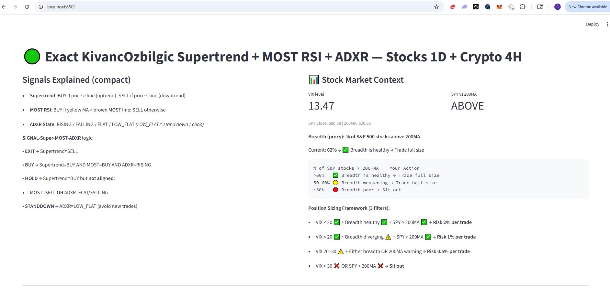
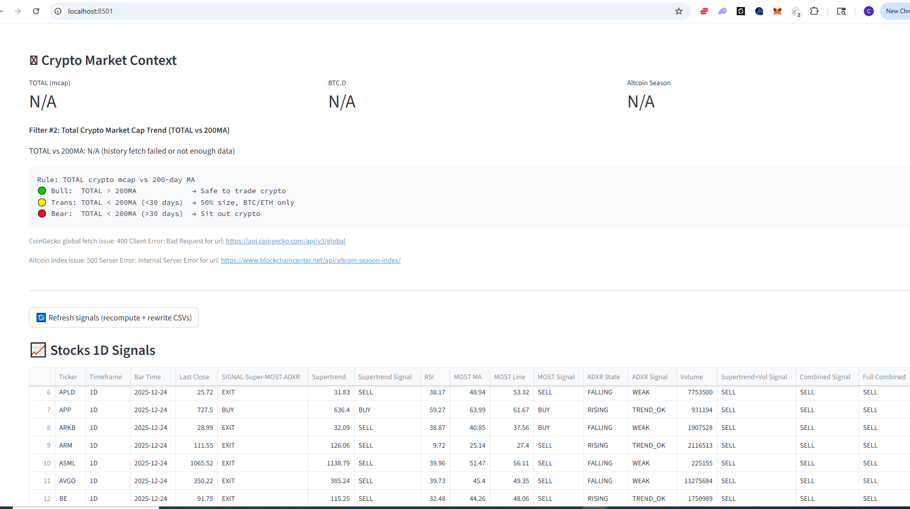
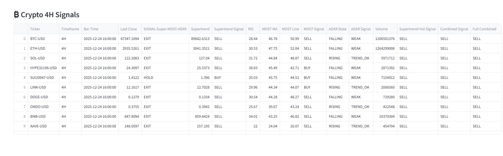

------

# 📈 myTrading — Rule-Based Trading Dashboard (Stocks & Crypto)




**myTrading** is an experimental, rule-based trading dashboard that combines **trend**, **momentum**, and **market context** into a single, opinionated decision framework.

The goal is **not** to predict markets or “beat” them, but to **trade intelligently** by:

- Avoiding bad market regimes
- Scaling risk up or down based on context
- Acting only when multiple independent signals align

This project is designed for **learning, experimentation, and disciplined execution**, not blind automation.

------

## 🧠 Philosophy 

Markets are noisy. Indicators fail when used in isolation.

This system follows three core principles:

1. **Trend first**
   Only trade in the direction of the dominant trend.
2. **Momentum confirmation**
   Enter or add only when momentum supports the trend.
3. **Market context matters**
   Even the best setup fails in a bad environment.
   Broader stock and crypto conditions determine *how much* risk to take — or whether to trade at all.

Instead of asking:

> “Is this a BUY or SELL?”

The system asks:

> “Is this market worth participating in — and at what size?”

------

## 🧭 What This App Does

- Computes **rule-based signals** for:
  - 📊 Stocks (1D timeframe)
  - ₿ Crypto (4H timeframe)
- Saves results as CSVs for transparency and reuse
- Displays everything in a **Streamlit dashboard**
- Separates **signal generation** from **UI**, so logic is reusable elsewhere

------

## 📊 Indicators Used (Conceptual Overview)

### 1️⃣ Supertrend (Trend Filter)

**Purpose:** Identify the primary trend.

- BUY → price above Supertrend line
- SELL → price below Supertrend line

This is the **first gate**.
If Supertrend is SELL → the system exits or avoids longs.

------

### 2️⃣ MOST RSI (Momentum Filter)

**Purpose:** Confirm whether momentum supports the trend.

- Uses RSI smoothed into:
  - **Yellow MA** (faster)
  - **Brown MOST line** (slower)
- BUY momentum → yellow MA above brown line
- SELL momentum → yellow MA below brown line

This prevents chasing trends that are already losing strength.

------

### 3️⃣ ADXR (Trend Strength & Stability)

**Purpose:** Measure *how stable* and *usable* a trend is.

ADXR is a smoothed version of ADX (Welles Wilder).

We classify it into **states**:

- **RISING** → trend strength improving (ideal for adding)
- **FLAT** → trend exists but is not strengthening
- **FALLING** → trend losing strength
- **LOW_FLAT** → no usable trend (stand down)

This avoids over-trading during chop.

------

## 🧩 Composite Signal Logic

All three indicators are combined into a **single actionable state**:

| Condition                                     | Result         |
| --------------------------------------------- | -------------- |
| Supertrend = SELL                             | **EXIT**       |
| Supertrend = BUY + MOST = BUY + ADXR = RISING | **BUY / ADD**  |
| Supertrend = BUY but momentum or ADXR weak    | **HOLD**       |
| ADXR = LOW_FLAT                               | **STAND DOWN** |

This enforces **patience and selectivity**.

------

## 🌍 Market Context Filters

Signals are **scaled**, not blindly followed.

### 📉 Stock Market Context

- **VIX level**
- **SPY vs 200-day moving average**
- **Breadth proxy** (% of S&P stocks above 200-MA)

These determine **position sizing**, not direction.

------

### 🪙 Crypto Market Context

#### Total Crypto Market Cap vs 200-MA

Measured using CoinGecko historical data.

| Condition              | Interpretation                |
| ---------------------- | ----------------------------- |
| TOTAL > 200-MA         | 🟢 Crypto bull → safe to trade |
| Below 200-MA < 30 days | 🟡 Transition → reduce size    |
| Below 200-MA > 30 days | 🔴 Bear → sit out crypto       |

#### Additional Context

- **BTC Dominance (BTC.D)**
- **Altcoin Season Index** (BlockchainCenter)

This helps distinguish:

- BTC-led markets
- Broad alt participation
- Risk-off phases

------

## 🖥️ User Interface (Streamlit)

The UI is intentionally simple:

- 🔄 **Refresh Signals** button
  Recomputes indicators and rewrites CSVs
- 📈 **Stocks 1D Signals**
- ₿ **Crypto 4H Signals**

Each table shows:

- Ticker
- Timeframe
- Last price
- Individual indicator states
- Final composite signal

The UI is a **viewer**, not the brain.
All logic lives in reusable Python modules.











------

## 🧑‍💻 Technical Architecture (Developer View)

```
myTrading/
├── app.py                # Streamlit UI
├── core/
│   ├── indicators.py     # Supertrend, MOST RSI, ADXR
│   ├── signals.py        # Composite signal rules
│   └── utils.py          # Helpers, formatting, IO
├── data/
│   ├── stocks.py         # Stock data fetch & signals
│   ├── crypto.py         # Crypto data & TOTAL vs 200MA
│   └── breadth.py        # Market breadth logic
├── outputs/
│   ├── supertrend_stocks_1d.csv
│   └── supertrend_crypto_4h.csv
```

### Key Design Decisions

- **No hidden state** — CSVs are explicit outputs
- **Functions over scripts** — logic can be reused elsewhere
- **Context ≠ Signal** — environment controls risk, not entries
- **API keys via env/secrets** — production-safe

------

## ⚠️ Important Notes

- This is **not financial advice**
- Signals are **rule-based**, not predictive
- The system will:
  - Miss tops and bottoms
  - Avoid many bad trades
- Best used as:
  - A decision aid
  - A discipline enforcer
  - A learning framework

------

## 🚀 Future Directions

- Broker integration (Charles Schwab, crypto wallets)
- Portfolio-level risk aggregation
- Backtesting modules
- Alerts & automation (optional, not default)

------

## 🧪 Final Thought

This project is about **thinking clearly under uncertainty**.

Markets change.
Rules adapt.
Discipline survives.

That’s the experiment.

